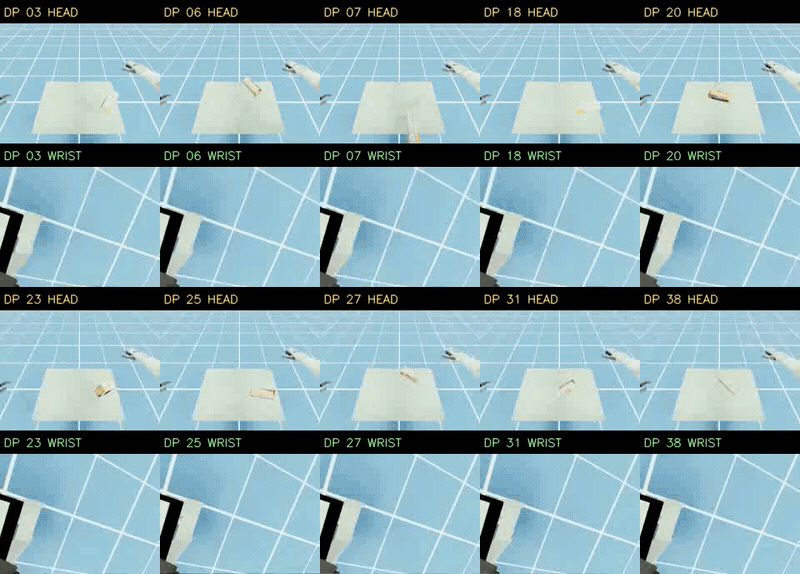
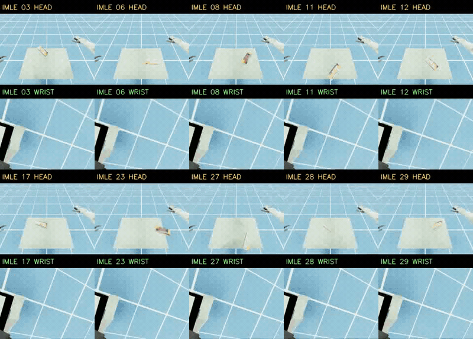
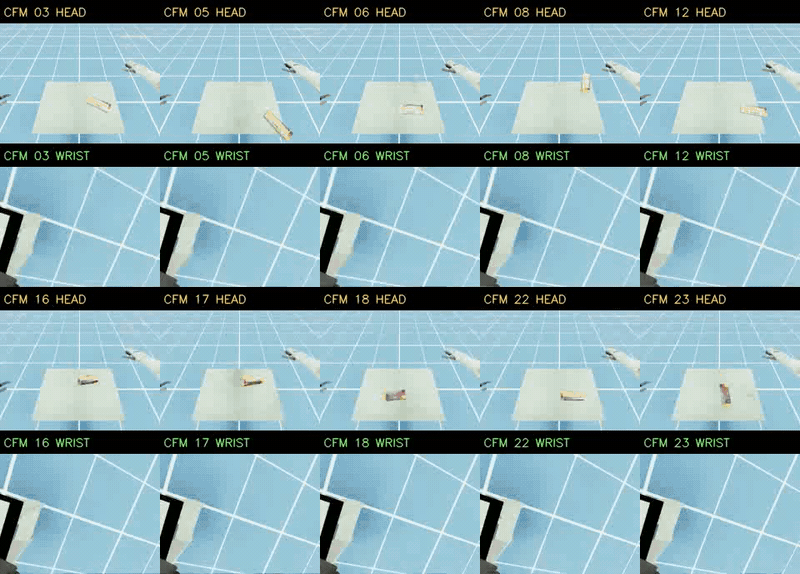

# Box 抓取失败案例 · 双相机对照

DP、IMLE、CFM patch49 混合数据 latest，每模型10条失败案例。每列同一回合：**上方HEAD（头部），下方WRIST（腕部）**，同步播放；上半区5条，下半区5条。

| 参数 | 设置 |
|---|---|
| 来源 | 2026-09-17 失败视频采集批次 |
| 场景 | Box A10V1 |
| 推理 | 逐步RPC＋GT；H16；300动作；模型seed42 |
| 失败定义 | 未曾连续5次动作观测满足：拇指＋至少两指接触目标，且相对抬升≥5cm |
| 播放 | 约10.1秒；按动作观测序列播放，不是实际运行速度 |

仅展示完成执行的失败回合，不含初始化／RPC异常。该批次收集满每模型10条失败后停止，不能用展示数量比较成功率，也不是随后每模型100次测试的录像。

## DP latest

## IMLE latest

## CFM patch49 latest

[样本与来源清单](docs/grasp-failure-gallery/manifest.json) · [SHA256校验](docs/grasp-failure-gallery/SHA256SUMS)

[成功案例分支](https://github.com/alex7537/flow-matching-test-a2d-v2/tree/docs/grasp-success-gallery)
